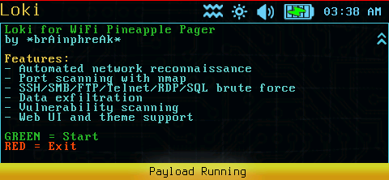
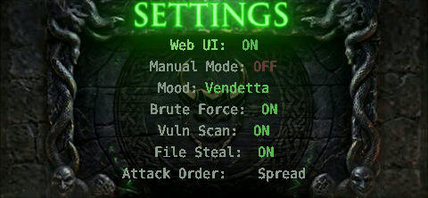
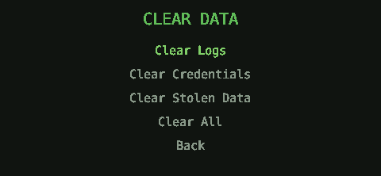

<p align="center">
  
</p>

A rewrite of [Bjorn](https://github.com/infinition/Bjorn) by infinition — the autonomous network reconnaissance Tamagotchi — for the WiFi Pineapple Pager. Improved with custom themes, hi-res graphics, web UI, and expanded attack functionality.

<p align="center">
  
  
  
  
</p>

## What is Loki?

Loki is a Tamagotchi-style autonomous network reconnaissance companion. It automatically:

- **Scans networks** for live hosts and open ports
- **Scans for vulnerabilities** using nmap NSE scripts with batched HTTP scanning and false positive filtering
- **Brute forces** discovered services (FTP, SSH, Telnet, SMB, RDP, MySQL)
- **Exfiltrates data** when credentials exist — file stealing runs independently and doesn't wait for brute force to complete
- **Displays status** with themed character animations on the Pager LCD

## Features

- **Autonomous Operation** — Set it and forget it. Loki continuously scans and attacks.
- **Host-by-Host Attack Strategy** — Runs all applicable attacks on each host (configurable: spread, per-host, or per-phase ordering)
- **Network Discovery** — ARP scanning with ICMP ping fallback for alive host detection
- **Hostname Resolution** — Multiple fallback methods (reverse DNS, NetBIOS, mDNS, nmap)
- **Port Scanning** — Configurable port list (40 ports default) with nmap integration
- **Vulnerability Scanning** — Nmap NSE script-based vuln scanning with batched HTTP checks optimized for MIPS. Connection-error false positives are automatically filtered out.
- **Manual Target Entry** — Add any IP or hostname as a target, including hosts on external networks
- **Virtual Host Support** — Scan multiple hostnames on the same IP with proper HTTP `Host:` header handling
- **Credential Brute Force** — Dictionary attacks against 6 discovered service protocols
- **Guest/Anonymous Detection** — Detects and logs guest access, skips brute force to avoid false positives
- **File Exfiltration** — Steals sensitive files from hosts with known credentials. Runs as soon as credentials exist — does not require brute force completion.
- **SQL Data Theft** — Dumps database tables from MySQL servers
- **Web Interface** — Real-time control panel and log viewer at `http://<pager-ip>:8000`. See [WEBUI_README.md](WEBUI_README.md) for details.
- **LCD Display** — Status updates on the Pager's full color screen with themed character animations and auto-dim for battery saving
- **Battery Indicator** — Real-time battery percentage in the header with charging state, auto-hides when unavailable
- **Real-Time Stats** — Data stolen counter updates immediately as files are exfiltrated. All stats refresh in real time.
- **Theme System** — 5 themes with custom animations, colors, fonts, and commentary. See [THEME_README.md](THEME_README.md) for details.

## Supported Protocols

### Brute Force & File Stealing

| Protocol | Port | Brute Force | File Stealing |
|----------|------|-------------|---------------|
| FTP      | 21   | Yes         | Yes           |
| SSH      | 22   | Yes         | Yes           |
| Telnet   | 23   | Yes         | Yes           |
| SMB      | 445  | Yes         | Yes           |
| MySQL    | 3306 | Yes         | Yes           |
| RDP      | 3389 | Yes         | No*           |

*RDP file exfiltration requires full xfreerdp with drive channels (not available on MIPS)

### Vulnerability Scanning & Service Enumeration

The vulnerability scanner uses nmap NSE scripts and covers a wide range of services beyond the brute force targets:

| Service | Port | Scan Type |
|---------|------|-----------|
| FTP | 21 | Enumeration (anon access, syst info) |
| SSH | 22 | Enumeration (algorithms, host keys) |
| Telnet | 23 | Enumeration (NTLM info, encryption) |
| SMTP | 25 | Enumeration (user enum, NTLM info) |
| Finger | 79 | Enumeration |
| HTTP/HTTPS | 80, 443, 8080, 8443 | Batched vuln scanning (XSS, SQLi, CSRF, shellshock, path enum, CMS detection, SSL analysis) |
| POP3 | 110 | Enumeration (capabilities, NTLM) |
| RPC | 111 | Enumeration (rpcinfo) |
| NetBIOS/SMB | 139, 445 | Enumeration (shares, users, security mode, protocols) |
| IMAP | 143 | Enumeration (capabilities, NTLM) |
| SNMP | 161 | Enumeration + community string brute force (UDP) |
| LDAP | 389 | Enumeration (rootDSE, search) |
| AFP | 548 | Enumeration (server info, showmount) |
| RTSP | 554 | Enumeration (methods) |
| CUPS | 631 | Enumeration (info, queue) |
| Rsync | 873 | Enumeration (list modules) |
| Java RMI | 1099 | Enumeration (registry dump) |
| MS-SQL | 1433 | Enumeration (info, NTLM) |
| Oracle | 1521 | Enumeration (TNS version) |
| MQTT | 1883 | Enumeration (subscribe) |
| NFS | 2049 | Enumeration (showmount) |
| iSCSI | 3260 | Enumeration (info) |
| MySQL | 3306 | Enumeration (info) |
| RDP | 3389 | Enumeration (encryption, NTLM) |
| SIP | 5060 | Enumeration (methods) |
| XMPP | 5222 | Enumeration (info) |
| AMQP | 5672 | Enumeration (info) |
| VNC | 5900 | Enumeration (info, auth bypass detection) |
| Redis | 6379 | Enumeration (info) |
| Memcached | 11211 | Enumeration (info) |
| MongoDB | 27017 | Enumeration (info, databases) |
| DNS | 53 | Reconnaissance (zone transfer, cache snoop, recursion) |
| All other ports | * | Generic `--script vuln` scan |

HTTP ports use batched NSE scripts optimized for MIPS to avoid CPU starvation. Non-HTTP ports use `--script vuln` in a single pass. Connection-error false positives are automatically filtered from results.

## Requirements

- WiFi Pineapple Pager
- **Network connection** — Pager must be connected to a network to scan (WiFi client mode or Ethernet/USB)
- **Internet connection** (first run only) — Required to install Python3 via opkg
- Nmap and all Python dependencies are bundled — only Python3 itself needs internet

## Installation

1. Copy the `payloads/` directory to your Pager's SD card:
   ```bash
   scp -r payloads/ root@<pager-ip>:/root/
   ```

2. Launch from the Pager's payload menu: **Reconnaissance > Loki**

3. Press **GREEN** to start Loki

<p align="center">
  
</p>

## Usage

### Graphical Menu

<p align="center">
  
</p>

When launching Loki, a graphical menu is displayed on the Pager LCD:

1. Dependencies are checked automatically
2. Network connectivity is verified
3. The menu displays:
   - **Start** — Begin scanning and attacking
   - **Network** — Select which network interface to use (LEFT/RIGHT to cycle)
   - **Theme** — Select display theme (LEFT/RIGHT to cycle, live preview)
   - **Display** — Toggle between Landscape and Portrait orientation
   - **Clear Data** — Submenu to clear logs, credentials, stolen data, or all data
   - **Settings** — Submenu for Web UI, Manual Mode, Mood, attack toggles, and attack order
   - **Exit** — Return to the Pager launcher

Use **UP/DOWN** to navigate, **A (GREEN)** to select, **B (RED)** to go back.

### Settings Submenu

<p align="center">
  
</p>

| Setting | Description |
|---------|-------------|
| **Web UI** | Toggle the web interface on/off |
| **Manual Mode** | Toggle manual attack mode (disables autonomous orchestrator) |
| **Mood** | Quick preset — theme-specific labels that configure brute force, vuln scan, file steal, and attack order together |
| **Brute Force** | Toggle brute force attacks on/off |
| **Vuln Scan** | Toggle vulnerability scanning on/off |
| **File Steal** | Toggle file exfiltration on/off |
| **Attack Order** | Spread (all hosts round-robin), Per Host (complete one host at a time), Per Phase (all brute force, then all steal, etc.) |

When Manual Mode is ON, the other settings are grayed out (N/A).

### Clear Data Submenu

<p align="center">
  
</p>

| Option | What it clears |
|--------|----------------|
| **Clear Logs** | All log files in `logs/` |
| **Clear Credentials** | Cracked password CSVs in `output/crackedpwd/` |
| **Clear Stolen Data** | Exfiltrated files in `output/data_stolen/` |
| **Clear All** | Everything above plus scan results, vulnerabilities, zombies, archives, netkb, and livestatus |

Each option requires confirmation before proceeding.

### Controls While Running

| Button | Action |
|--------|--------|
| **B (RED)** | Open Pause Menu |

### Pause Menu

<p align="center">
  
  
</p>

Press **B** while Loki is running to open the pause menu:

| Option | Description |
|--------|-------------|
| **Brightness** | Adjust screen brightness 20–100% with LEFT/RIGHT (landscape) or UP/DOWN (portrait) |
| **MAIN MENU** | Stop Loki and return to the graphical start menu |
| **> Pagergotchi** | Hand off to Pagergotchi (only shown if installed) |
| **EXIT PAYLOAD** | Stop Loki and return to the Pager launcher |

**Payload handoff:** Loki dynamically discovers other payloads via `launch_*.sh` scripts in the payload directory. Each launcher script declares a `# Title:` and `# Requires:` path — if the required path exists, the launcher appears as a menu option. Selecting it writes the launcher path to `data/.next_payload` and exits with code 42, which `payload.sh` picks up to launch the target payload.

The screen automatically dims after a configurable timeout to save battery. Any button press wakes the screen.

### Web Interface

Loki includes a full web UI at `http://<pager-ip>:8000` with Dashboard, Hosts, Attacks, Loot, Config, Terminal, and Display tabs. See [WEBUI_README.md](WEBUI_README.md) for full documentation and screenshots.

<p align="center">
  
</p>

### Display Modes

Loki supports both landscape and portrait orientations, switchable from the startup menu or config. All themes, menus, and the pause screen adapt to the selected orientation.

<p align="center">
  
  
</p>

### Themes

Loki ships with 5 themes, each with custom animations, colors, fonts, menus, and commentary personality. All themes support both orientations. See [THEME_README.md](THEME_README.md) for full details and a guide to creating custom themes.

| Theme | Display Name | Creator | Description |
|-------|-------------|---------|-------------|
| `loki` | LOKI | brAinphreAk | Default theme with Norse trickster personality |
| `bjorn` | BJORN | infinition | Original Bjorn Viking theme |
| `clown` | ClownSec | brAinphreAk | CLOWNSEC jester theme with circus commentary |
| `pirate` | Cap'n Plndr | brAinphreAk | Pirate theme with seafaring personality |
| `knight` | Sir Haxalot | Zombie Joe | Medieval knight theme with chivalric personality |

<p align="center">
  
  
  
  
  
</p>

## Configuration

Edit `config/shared_config.json` to customize Loki's behavior:

### General Settings
| Setting | Default | Description |
|---------|---------|-------------|
| `manual_mode` | false | Enable manual attack mode (disables orchestrator) |
| `websrv` | true | Enable the web server |
| `debug_mode` | true | Enable debug mode |
| `retry_success_actions` | false | Retry actions that previously succeeded |
| `retry_failed_actions` | true | Retry actions that previously failed |
| `max_failed_retries` | 3 | Max retry attempts before giving up on a failed action |
| `blacklist_gateway` | true | Automatically blacklist the network gateway |
| `blacklistcheck` | true | Enable blacklist checking |
| `clear_hosts_on_startup` | false | Clear discovered hosts when starting a new raid |

### Attack Settings
| Setting | Default | Description |
|---------|---------|-------------|
| `brute_force_running` | true | Enable brute force attacks |
| `file_steal_running` | true | Enable file exfiltration |
| `scan_vuln_running` | true | Enable vulnerability scanning |
| `attack_order` | spread | Attack ordering: `spread`, `per_host`, or `per_phase` |

### Timing Settings
| Setting | Default | Description |
|---------|---------|-------------|
| `scan_interval` | 180 | Seconds between network scans |
| `failed_retry_delay` | 600 | Seconds before retrying failed actions |
| `success_retry_delay` | 900 | Seconds before retrying successful actions |
| `startup_delay` | 10 | Delay before starting orchestrator |
| `web_delay` | 2 | Web server startup delay |
| `livestatus_delay` | 8 | Seconds between livestatus CSV updates |

### Network Settings
| Setting | Default | Description |
|---------|---------|-------------|
| `scan_network_prefix` | 24 | Network prefix for scanning (e.g., /24) |
| `nmap_scan_aggressivity` | -T2 | Nmap timing template (-T0 to -T5) |
| `portlist` | [...] | List of ports to scan (40 ports by default) |
| `mac_scan_blacklist` | [] | MAC addresses to exclude from scanning |
| `ip_scan_blacklist` | [] | IP addresses to exclude from scanning |
| `vuln_scan_timeout` | 120 | Timeout for vulnerability scans (seconds) |

### File Stealing Settings
| Setting | Default | Description |
|---------|---------|-------------|
| `steal_max_depth` | 3 | Maximum directory depth to search |
| `steal_max_files` | 500 | Maximum files to discover per host |
| `steal_file_names` | [...] | Specific filenames to steal (e.g., `id_rsa`, `.env`, `.bash_history`) |
| `steal_file_extensions` | [...] | File extensions to steal (e.g., `.pem`, `.sql`, `.db`, `.kdbx`) |

### Performance Settings
| Setting | Default | Description |
|---------|---------|-------------|
| `worker_threads` | 5 | Number of concurrent brute force threads |
| `bruteforce_queue_timeout` | 600 | Seconds before a queued brute force task times out |
| `bruteforce_attempt_timeout` | 30 | Timeout per brute force attempt (seconds) |
| `bruteforce_max_retries` | 3 | Max retries per brute force attempt |
| `bruteforce_max_total_retries` | 15 | Max total retries for an entire brute force action |

### Time Wait Settings
| Setting | Default | Description |
|---------|---------|-------------|
| `timewait_ftp` | 0 | Delay between FTP brute force attempts (seconds) |
| `timewait_ssh` | 0 | Delay between SSH brute force attempts (seconds) |
| `timewait_telnet` | 0 | Delay between Telnet brute force attempts (seconds) |
| `timewait_smb` | 0 | Delay between SMB brute force attempts (seconds) |
| `timewait_sql` | 0 | Delay between MySQL brute force attempts (seconds) |
| `timewait_rdp` | 0 | Delay between RDP brute force attempts (seconds) |

### Display Settings
| Setting | Default | Description |
|---------|---------|-------------|
| `screen_brightness` | 80 | Default screen brightness (20-100%) |
| `screen_dim_brightness` | 25 | Brightness when dimmed (20-100%) |
| `screen_dim_timeout` | 60 | Seconds of inactivity before dimming |
| `screen_rotation` | 270 | Display rotation (270 = landscape, 0 = portrait) |

### Theme Settings
| Setting | Default | Description |
|---------|---------|-------------|
| `theme` | loki | Active theme folder name (see [THEME_README.md](THEME_README.md)) |
| `override_theme_delays` | false | Use global config delay values instead of per-theme values |

### Logging Settings
| Setting | Default | Description |
|---------|---------|-------------|
| `log_debug` | false | Log DEBUG level messages |
| `log_info` | true | Log INFO level messages |
| `log_warning` | true | Log WARNING level messages |
| `log_error` | true | Log ERROR level messages |
| `log_critical` | true | Log CRITICAL level messages |

### Dictionary Files

Customize brute force wordlists in `resources/dictionary/`:
- `users.txt` — Usernames to try
- `passwords.txt` — Passwords to try

## Display Icons

### Stats Grid (top-right)

| Position | Icon | Name | Description |
|----------|------|------|-------------|
| Row 1, Left | Target | `target` | Alive hosts found |
| Row 1, Middle | Folder | `port` | Open ports discovered |
| Row 1, Right | Stack | `vuln` | Vulnerabilities found |
| Row 2, Left | Lock | `cred` | Credentials cracked |
| Row 2, Middle | Skull | `zombie` | Compromised hosts |
| Row 2, Right | File | `data` | Data files stolen |

### Viking Stats (around character)

| Position | Icon | Name | Description |
|----------|------|------|-------------|
| Top-left | Coins | `gold` | Total score |
| Bottom-left | Up arrow | `level` | Loki's level |
| Top-right | Network | `hosts` | Known hosts discovered |
| Bottom-right | Swords | `attacks` | Attacks performed |

## Attack Flow

Loki processes hosts using the configured attack order strategy. The default ("spread") works as follows:

1. **Network Scan** — Discover alive hosts and open ports
2. **For each alive host:**
   - Run brute force attacks (SSH, FTP, SMB, Telnet, SQL, RDP) on open ports
   - Run file stealing actions for any protocol where credentials exist
   - Run vulnerability scan (nmap NSE scripts) on open ports
   - Move to the next host
3. **Repeat** — Continuous scanning for new hosts

File stealing runs independently — it only needs existing credentials for the relevant protocol, not brute force completion. If credentials are found by any means (brute force, guest detection, or a previous run), file stealing will execute.

### Attack Order Strategies

| Strategy | Behavior |
|----------|----------|
| **Spread** | Round-robin: process all hosts for brute force, then all for file steal, then all for vuln scan |
| **Per Host** | Complete all phases (brute force -> file steal -> vuln scan) on one host before moving to the next |
| **Per Phase** | Run brute force on all hosts, then file steal on all hosts, then vuln scan on all hosts |

## Output Locations

All data is stored in `/mmc/root/loot/loki/`:

```
/mmc/root/loot/loki/
├── netkb.csv              # Network knowledge base (discovered hosts)
├── livestatus.csv         # Current scan status
├── logs/                  # Application logs (one file per module)
├── archives/              # Archived netkb.csv files
└── output/
    ├── crackedpwd/        # Cracked credentials by protocol
    │   ├── ftp.csv
    │   ├── ssh.csv
    │   ├── smb.csv
    │   ├── sql.csv
    │   ├── telnet.csv
    │   └── rdp.csv
    ├── data_stolen/       # Exfiltrated files by protocol/host
    │   ├── ftp/<mac>_<ip>/
    │   ├── ssh/<mac>_<ip>/
    │   ├── smb/<mac>_<ip>/
    │   ├── sql/<mac>_<ip>/     # Database table dumps
    │   ├── telnet/<mac>_<ip>/
    │   └── recon/file_listings/  # Complete file listings
    ├── scan_results/      # Network scan results
    └── vulnerabilities/   # Nmap vulnerability scan results
```

## Architecture

```
loki/
├── payload.sh             # Launcher script (handles exit codes, spinner)
├── loki_menu.py           # Graphical startup menu (interface, theme, settings)
├── Loki.py                # Main entry point
├── display.py             # Pager LCD display (pagerctl, pause menu, payload handoff)
├── orchestrator.py        # Task scheduler (spread/per-host/per-phase strategies)
├── shared.py              # Shared state & config
├── utils.py               # Web server utilities
├── webapp.py              # HTTP server (web UI + API)
├── logger.py              # Logging with per-module log files
├── pagerctl.py            # Pager hardware interface
├── libpagerctl.so         # Native display library
├── comment.py             # Viking commentary engine
├── cve_lookup.py          # KEV/NVD CVE enrichment
├── device_classifier.py   # OUI-based device classification
├── init_shared.py         # Shared data initializer
├── timeout_utils.py       # Timeout helpers
├── launch_pagergotchi.sh  # Handoff launcher for Pagergotchi
├── bin/                   # Native binaries (MIPS)
│   ├── nmap               # Network scanner
│   ├── sfreerdp           # FreeRDP client (auth-only)
│   ├── xfreerdp           # FreeRDP client (full)
│   ├── smb2-cat           # libsmb2 file reader
│   ├── smb2-find          # libsmb2 file finder
│   └── smb2-share-enum    # libsmb2 share enumerator
├── lib/                   # Bundled Python packages + native libs
│   ├── paramiko/          # SSH library
│   ├── cryptography/      # Crypto (paramiko dep)
│   ├── bcrypt/            # Password hashing (paramiko dep)
│   ├── nacl/              # PyNaCl (paramiko dep)
│   ├── getmac/            # MAC address lookup
│   ├── pymysql/           # MySQL client
│   ├── nmap/              # python-nmap
│   ├── smb/               # pysmb
│   ├── tqdm/              # Progress bars
│   ├── libssh2.so.1       # SSH2 native lib
│   ├── liblua5.4.so.0     # Lua (nmap dep)
│   ├── libsodium.so       # Crypto native lib
│   └── ...
├── share/                 # Data files
│   └── nmap/              # Nmap scripts, service probes, NSE libs
├── actions/               # Attack modules
│   ├── scanning.py            # Network + port scanner
│   ├── nmap_vuln_scanner.py   # Vulnerability scanner (batched NSE)
│   ├── ftp_connector.py       # FTP brute force
│   ├── ssh_connector.py       # SSH brute force
│   ├── telnet_connector.py    # Telnet brute force
│   ├── smb_connector.py       # SMB brute force
│   ├── sql_connector.py       # MySQL brute force
│   ├── rdp_connector.py       # RDP brute force
│   ├── steal_files_ftp.py     # FTP file exfiltration
│   ├── steal_files_ssh.py     # SSH file exfiltration
│   ├── steal_files_telnet.py  # Telnet file exfiltration
│   ├── steal_files_smb.py     # SMB file exfiltration
│   ├── steal_data_sql.py      # MySQL data exfiltration
│   └── IDLE.py                # Idle/cooldown action
├── config/
│   ├── shared_config.json     # User configuration
│   └── actions.json           # Action module definitions
├── data/
│   └── kev_catalog.json       # CISA KEV vulnerability catalog
├── themes/                # Theme packs (see THEME_README.md)
│   ├── loki/              # Default Loki theme
│   ├── bjorn/             # Original Viking theme
│   ├── clown/             # CLOWNSEC jester theme
│   ├── pirate/            # Cap'n Plndr pirate theme
│   └── knight/            # Sir Haxalot knight theme
├── web/                   # Web UI (see WEBUI_README.md)
│   ├── index.html         # SPA shell
│   ├── manifest.json      # PWA manifest
│   ├── css/
│   │   └── loki.css       # Theme styles
│   ├── scripts/
│   │   ├── app.js         # SPA router & polling manager
│   │   ├── dashboard.js   # Stats grid + status
│   │   ├── console.js     # Integrated log console
│   │   ├── network.js     # Host cards + attack badges
│   │   ├── attacks.js     # Timeline + manual mode
│   │   ├── loot.js        # Credentials, files, vulns, logs
│   │   ├── config.js      # Settings editor
│   │   ├── terminal.js    # Device command execution
│   │   └── loki.js        # LCD framebuffer mirror
│   ├── fonts/
│   │   └── Viking.TTF
│   └── images/            # Favicons + PWA icons
└── resources/
    ├── dictionary/        # Wordlists (users.txt, passwords.txt)
    └── fonts/             # Display fonts (Arial, DejaVuSansMono)
```

## Manual Attack Mode

Manual mode pauses the orchestrator and gives you full control over individual attacks from the web UI.

### Adding Custom Targets

The Attacks tab includes a text input for adding any IP address or hostname as a target — including hosts on networks other than the current one:

- **IP address** (e.g., `10.0.0.50`) — Added directly to the target list
- **Hostname** (e.g., `example.com`) — Resolved to IPv4 and added with hostname metadata
- Manual entries get `MAC Address = manual` to distinguish them from network-scanned hosts

### Virtual Host (vhost) Scanning

Multiple hostnames on the same IP are supported. Each hostname gets its own entry in the target list:

1. Add `site1.com` — resolves to `93.184.216.34`, shown as `93.184.216.34 (site1.com)`
2. Add `site2.com` — same IP, new entry shown as `93.184.216.34 (site2.com)`
3. Port scan either one — ports are shared across all entries for the same IP
4. Vuln scan `site1.com` — nmap sends `Host: site1.com` header for HTTP scripts
5. Vuln scan `site2.com` — nmap sends `Host: site2.com` header for HTTP scripts

This ensures HTTP vulnerability scripts hit the correct virtual host instead of just the server's default site.

### Vulnerability Scanning

Select a target IP, choose a port (or "All Open Ports"), and select "Vuln Scan" from the action dropdown:

- **Single port** — Scans only that port for vulnerabilities
- **All Open Ports** — Scans every open port on the host

HTTP ports (80, 443, 8080, 8443) use batched NSE scripts optimized for MIPS to avoid CPU starvation. Non-HTTP ports use `--script vuln` in a single pass. Connection-error false positives are automatically filtered from results.

## Logging

Logs are stored in `/mmc/root/loot/loki/logs/` with one file per module. Toggle log levels in the config (`log_debug`, `log_info`, `log_warning`, `log_error`, `log_critical`).

View combined logs via the web interface Dashboard console or:
```bash
tail -f /mmc/root/loot/loki/logs/*.log
```

## Test Targets

A Docker-based vulnerable test environment is provided in `test_targets/`. See [`TEST_TARGETS.md`](TEST_TARGETS.md) for setup and usage.

## Troubleshooting

### Loki won't start
- Check that the Pager has internet access (required for first run to install Python3)
- The payload automatically installs Python3 via opkg — check the display for installation progress
- If installation fails, try running the payload again with internet connectivity

### No hosts discovered
- Check that you're connected to an active network
- Verify the target network has hosts
- Check `mac_scan_blacklist` and `ip_scan_blacklist` in config

### Brute force takes too long
- Reduce the dictionary size in `resources/dictionary/`
- Increase `nmap_scan_aggressivity` (e.g., `-T4`)
- Reduce `portlist` to only essential ports

### Web interface not loading
- Verify Loki is running (`ps | grep python`)
- Check firewall rules
- Try accessing via the Pager's br-lan IP

---

## Credits

- **Original Bjorn**: [infinition](https://github.com/infinition/Bjorn)
- **Pager Port**: brAinphreAk
- **WiFi Pineapple Pager**: Hak5

### Special Thanks

**Zombie Joe** — First to test the custom theme engine with his Knight theme, and provided many great suggestions for theme and UI improvements that have been integrated into Loki.

## License

MIT License — See [LICENSE](LICENSE)

## Disclaimer

This tool is for authorized security testing and educational purposes only. Only use on networks you own or have explicit permission to test. The authors are not responsible for misuse.
