# Loki Theme System

Loki uses a **skin-based** theme system. The main display, menus, and pause screen each use a full-resolution background image with all static elements (title, icons, grid lines, frise) baked in. Only dynamic content (stat numbers, status text, character animation, dialogue) is drawn on top at runtime.

This gives theme creators complete artistic control — any layout, any style, any icon design. Just create your images and define where the dynamic text goes.

## Included Themes

| Theme | Theme Name | Animation Mode | Author |
|-------|-----------|----------------|--------|
| `loki_dark` | Loki (Dark) | Sequential | brAinphreAk |
| `loki` | Loki (Light) | Sequential | brAinphreAk |
| `bjorn` | Bjorn | Random | infinition |
| `clown` | ClownSec | Random | brAinphreAk |
| `pirate` | Cap'n Plndr | Random | brAinphreAk |
| `knight` | Sir Haxalot | Sequential | Zombie Joe |

### Loki Dark (Default)

Black background with green text — classic hacker terminal aesthetic. Uses the same character animations and menu backgrounds as Loki (Light).

<table><tr>
<td valign="top">
  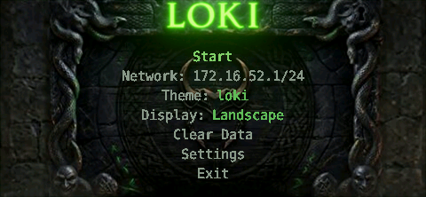<br>
  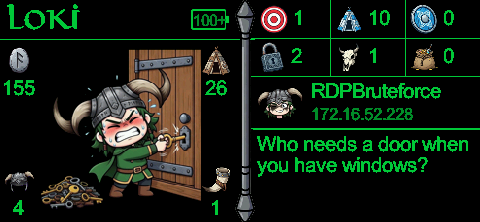
</td>
<td valign="top">
  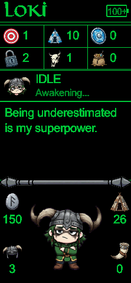
</td>
</tr></table>

### Loki (Light)

<table><tr>
<td valign="top">
  <br>
  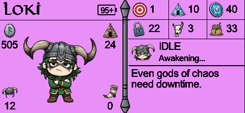
</td>
<td valign="top">
  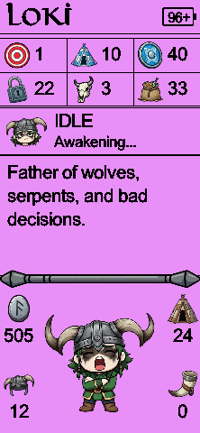
</td>
</tr></table>

### Bjorn

<table><tr>
<td valign="top">
  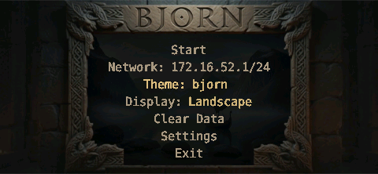<br>
  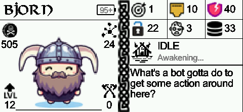
</td>
<td valign="top">
  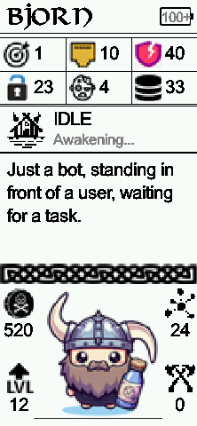
</td>
</tr></table>

### ClownSec

<table><tr>
<td valign="top">
  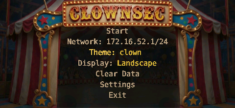<br>
  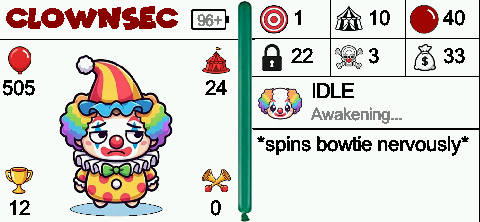
</td>
<td valign="top">
  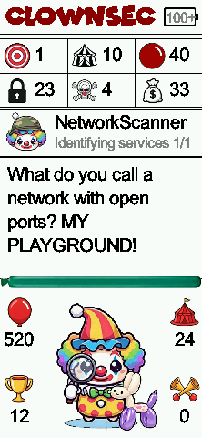
</td>
</tr></table>

### Cap'n Plndr (Pirate)

<table><tr>
<td valign="top">
  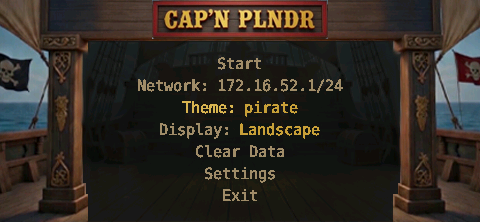<br>
  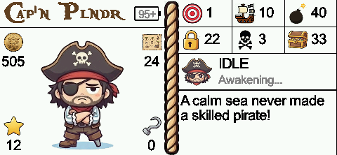
</td>
<td valign="top">
  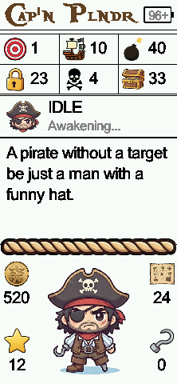
</td>
</tr></table>

### Sir Haxalot (Knight)

<table><tr>
<td valign="top">
  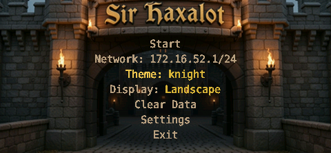<br>
  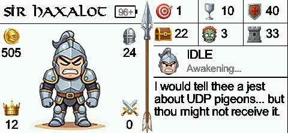
</td>
<td valign="top">
  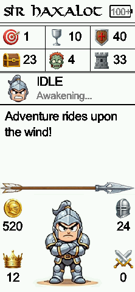
</td>
</tr></table>

## Switching Themes

Three ways to change themes:

1. **Startup menu** — Use LEFT/RIGHT on the Theme option (live preview on the LCD)
2. **Web UI** — Change the `theme` setting in the Config tab
3. **Config file** — Edit `config/shared_config.json`:
   ```json
   "theme": "pirate"
   ```

## Mood Presets

Each theme defines custom labels for the three mood presets available in the Settings menu. Moods are shortcuts that configure brute force, vuln scan, file steal, and attack order together.

| Theme | Target | Swarm | Recon |
|-------|--------|-------|-------|
| loki_dark | Vendetta | Chaotic | Slither |
| loki | Vendetta | Chaotic | Slither |
| bjorn | Raiding | Berserker | Scouting |
| clown | Psychotic | Silly | Mime Mode |
| pirate | Plundering | Broadside | Parley |
| knight | Crusading | Berserker | Chivalrous |

| Mood | Brute Force | Vuln Scan | File Steal | Attack Order |
|------|------------|-----------|------------|-------------|
| Target | ON | ON | ON | per_host |
| Swarm | ON | ON | ON | spread |
| Recon | OFF | OFF | OFF | spread |

---

# Creating a Custom Theme

## How It Works

The main display uses a **skin image** — a single full-resolution background that contains everything static: the theme title, all icons, grid lines, frise divider, and any decorative elements. At runtime, only dynamic content is drawn on top of this image:

- **Stat values** (numbers) — target, port, vuln, cred, zombie, data, gold, level, networkkb, attacks
- **Character animation** — the animated character sprite
- **Status** — action icon and status text (2 lines)
- **Dialogue** — AI commentary text
- **Battery** — percentage text

You control **exactly where** each dynamic element is placed via coordinates in `theme.json`. You can also customize the font and color of each element independently.

## Directory Structure

```
themes/
  my_theme/
    theme.json                   # Required — theme configuration
    fonts/
      title.TTF                  # Title font (used by menu system)
      menu.ttf                   # Menu body font (optional)
      stats.ttf                  # Custom font for stat numbers (optional)
      dialogue.ttf               # Custom font for commentary (optional)
    images/
      main_bg.png                # Main display skin — landscape (480x222)
      main_bg_portrait.png       # Main display skin — portrait (222x480)
      menu_bg.png                # Main menu background (480x222)
      settings_bg.png            # Settings submenu background (480x222)
      pause_bg.png               # Pause menu background — landscape (480x222)
      pause_bg_portrait.png      # Pause menu background — portrait (222x480)
      status/                    # Character animations + status icons per action
        IDLE/
          IDLE.png               # Status bar icon
          IDLE1.png              # Animation frame 1
          IDLE2.png              # Animation frame 2
          ...
        NetworkScanner/
          NetworkScanner.png
          NetworkScanner1.png
          ...
        SSHBruteforce/
        FTPBruteforce/
        TelnetBruteforce/
        SMBBruteforce/
        SQLBruteforce/
        RDPBruteforce/
        StealFilesSSH/
        StealFilesFTP/
        StealFilesSMB/
        StealFilesTelnet/
        StealDataSQL/
        NmapVulnScanner/
    comments/
      comments.json              # Commentary lines by action type
```

## Creating Skin Images

Skin images are full-resolution PNG files that contain all static UI elements baked in. Design them from scratch in any image editor (Photoshop, GIMP, Figma, etc.). The skin should include:

- Theme title text
- All stat icons positioned where you want them
- Grid lines, borders, decorative elements
- Frise / divider
- Battery icon outline
- Any other static artwork

Leave blank space where dynamic content will be drawn (stat numbers, character area, status text, dialogue text). Then define the exact pixel coordinates for each dynamic element in `theme.json`.

**Landscape**: 480x222 pixels, saved as `images/main_bg.png`
**Portrait**: 222x480 pixels, saved as `images/main_bg_portrait.png`

## Image Specifications

### Skin Background (`main_bg.png`, `main_bg_portrait.png`)

- **Landscape**: 480x222 pixels
- **Portrait**: 222x480 pixels
- **Format**: PNG (recommended) or BMP
- Contains all static elements — title, icons, grid, frise, decorations

### Character Animation Frames (`images/status/`)

- **Recommended size**: 175x175 pixels (scaled to fit the character area)
- **Format**: PNG (with alpha transparency) or BMP
- **Naming**: Base name matches the action class, numbered sequentially: `IDLE.png`, `IDLE1.png`, `IDLE2.png`, ...
- **Animation modes**: Set `animation_mode` in `theme.json`:
  - `"random"` — Picks a random frame each cycle
  - `"sequential"` — Plays frames in order for smooth animation

### Menu Backgrounds

- **Landscape**: 480x222 pixels
- **Portrait**: 222x480 pixels
- **Format**: PNG (recommended) or BMP
- **Files**: `menu_bg.png`, `settings_bg.png`, `pause_bg.png`, `pause_bg_portrait.png`
- All titles should be baked into the background images

## theme.json Reference

A complete `theme.json` with all available fields:

```json
{
    "theme_name": "My Theme",
    "web_title": "My Theme",

    "text_color": [255, 255, 255],
    "accent_color": [128, 128, 128],

    "animation_mode": "sequential",
    "image_display_delaymin": 1.5,
    "image_display_delaymax": 2,
    "comment_delaymin": 15,
    "comment_delaymax": 30,

    "moods": {
        "target": "Hunting",
        "swarm": "Frenzy",
        "recon": "Stealth"
    },

    "skin_layout_landscape": {
        "stats": {
            "font": "stats.ttf",
            "color": [255, 255, 255],
            "align": "left",
            "target": {"x": 293, "y": 7, "align": "left"},
            "port": {"x": 368, "y": 7, "align": "left"},
            "vuln": {"x": 443, "y": 7, "align": "left"},
            "cred": {"x": 293, "y": 45, "align": "left"},
            "zombie": {"x": 368, "y": 45, "align": "left"},
            "data": {"x": 443, "y": 45, "align": "left"},
            "gold": {"x": 4, "y": 77, "align": "left"},
            "level": {"x": 4, "y": 197, "align": "left"},
            "networkkb": {"x": 201, "y": 77, "align": "left"},
            "attacks": {"x": 201, "y": 197, "align": "left"}
        },
        "character": {"x": 31, "y": 49, "w": 170, "h": 170, "align": "left"},
        "status": {
            "show_icon": true,
            "icon_x": 257, "icon_y": 79, "icon_size": 46,
            "font": "status.ttf",
            "color": [255, 255, 255],
            "sub_color": [128, 128, 128],
            "text_x": 310, "text_y": 80,
            "sub_text_y": 105,
            "main_font_size": 23, "sub_font_size": 19,
            "max_text_w": 166,
            "align": "left"
        },
        "dialogue": {
            "x": 257, "y": 133,
            "max_w": 219,
            "font": "dialogue.ttf",
            "color": [200, 200, 200],
            "font_size": 23, "line_height": 21,
            "max_lines": 4,
            "align": "left"
        },
        "battery": {"x": 209, "y": 11, "font_size": 18, "align": "center"}
    },

    "skin_layout_portrait": {
        "stats": {
            "align": "left",
            "target": {"x": 38, "y": 49, "align": "left"},
            "port": {"x": 112, "y": 49, "align": "left"},
            "vuln": {"x": 186, "y": 49, "align": "left"},
            "cred": {"x": 38, "y": 87, "align": "left"},
            "zombie": {"x": 112, "y": 87, "align": "left"},
            "data": {"x": 186, "y": 87, "align": "left"},
            "gold": {"x": 4, "y": 361, "align": "left"},
            "level": {"x": 4, "y": 445, "align": "left"},
            "networkkb": {"x": 186, "y": 361, "align": "left"},
            "attacks": {"x": 186, "y": 445, "align": "left"}
        },
        "character": {"x": 38, "y": 327, "w": 145, "h": 145, "align": "left"},
        "status": {
            "icon_x": 6, "icon_y": 122, "icon_size": 46,
            "text_x": 60, "text_y": 123,
            "sub_text_y": 148,
            "main_font_size": 23, "sub_font_size": 19,
            "max_text_w": 158,
            "align": "left"
        },
        "dialogue": {
            "x": 8, "y": 180, "max_w": 206,
            "font_size": 23, "line_height": 26,
            "max_lines": 4,
            "align": "left"
        },
        "battery": {"x": 198, "y": 10, "font_size": 18, "align": "center"}
    },

    "menu_colors": {
        "bg": [18, 22, 18],
        "title": [100, 190, 90],
        "selected": [130, 210, 110],
        "unselected": [140, 155, 140],
        "on": [90, 180, 80],
        "off": [100, 60, 60],
        "dim": [70, 85, 70],
        "warning": [180, 160, 50],
        "submenu": [100, 190, 90]
    },

    "pause_menu_colors": {
        "bg": [18, 22, 18],
        "text": [130, 210, 110],
        "accent": [60, 100, 60]
    },

    "web": {
        "bg_dark": "#0a120a",
        "bg_surface": "#121a12",
        "bg_elevated": "#1a251a",
        "accent": "#5ebd45",
        "accent_bright": "#7ed860",
        "accent_dim": "#3a8a28",
        "text_primary": "#d4e8d4",
        "text_secondary": "#7e9a7e",
        "text_muted": "#566b56",
        "border": "#263a26",
        "border_light": "#364a36",
        "glow": "0 0 12px rgba(94, 189, 69, 0.25)",
        "font_title": "'Viking', 'Georgia', serif",
        "nav_label_display": "Display"
    }
}
```

### Field Reference

#### Identity

| Field | Required | Description |
|-------|----------|-------------|
| `theme_name` | Yes | Theme name — shown in the theme selector, splash screen, and logs |
| `web_title` | Yes | Browser tab title for the web UI |

#### Runtime Colors

| Field | Format | Description |
|-------|--------|-------------|
| `text_color` | `[R, G, B]` | Default color for all dynamic text (stat numbers, status, dialogue) |
| `accent_color` | `[R, G, B]` | Accent color for status sub-text and battery charging indicator |

These are defaults — each element can override its color in the skin layout (see below).

#### Animation & Timing

| Field | Default | Description |
|-------|---------|-------------|
| `animation_mode` | `"random"` | Frame selection: `"random"` or `"sequential"` |
| `image_display_delaymin` | 7 | Min seconds between animation frame changes |
| `image_display_delaymax` | 15 | Max seconds between animation frame changes |
| `comment_delaymin` | 15 | Min seconds between commentary updates |
| `comment_delaymax` | 30 | Max seconds between commentary updates |

#### Moods

| Field | Description |
|-------|-------------|
| `moods.target` | Label for the "Target" mood preset (aggressive, per-host attacks) |
| `moods.swarm` | Label for the "Swarm" mood preset (all attacks, spread across hosts) |
| `moods.recon` | Label for the "Recon" mood preset (scanning only, no attacks) |

#### Skin Layout (`skin_layout_landscape` / `skin_layout_portrait`)

These define where dynamic content is drawn on top of the skin image. Each orientation has its own layout.

**Coordinate system**: All `x` and `y` values are **exact pixel positions** where the text or image is drawn — no automatic centering or offset math. What you set is what you get.

**Alignment**: Every text element supports an `"align"` field:
- `"left"` (default) — `x` is the left edge of the text
- `"center"` — `x` is the center point; text is centered around it
- `"right"` — `x` is the right edge of the text

**Shared properties**: Each section (`stats`, `status`, `dialogue`, `battery`) can define `font`, `color`, and `align` at the section level. Individual items inherit these but can override them.

##### Stats

All 10 stat values in one section. Place them anywhere on your skin.

| Field | Default | Description |
|-------|---------|-------------|
| `stats.font` | Arial | Font filename for all stats (looked up in theme `fonts/` dir) |
| `stats.color` | text_color | `[R,G,B]` color for all stats |
| `stats.align` | `"left"` | Text alignment for all stats (`"left"`, `"center"`, or `"right"`) |
| `stats.{name}.x` | — | X position for this stat's number (required) |
| `stats.{name}.y` | — | Y position for this stat's number (required) |
| `stats.{name}.font_size` | 23 | Font size override for this stat |
| `stats.{name}.font` | (inherits) | Font override for this specific stat |
| `stats.{name}.color` | (inherits) | `[R,G,B]` color override for this specific stat |
| `stats.{name}.align` | (inherits) | Alignment override for this specific stat |

**Stat names**: `target`, `port`, `vuln`, `cred`, `zombie`, `data`, `gold`, `level`, `networkkb`, `attacks`

Stats without `x` and `y` coordinates are not drawn. This means you can selectively hide stats by omitting their coordinates.

##### Character

| Field | Default | Description |
|-------|---------|-------------|
| `character.x` | — | X position of animation area (required) |
| `character.y` | — | Y position of animation area (required) |
| `character.w` | — | Width of animation area (required) |
| `character.h` | — | Height of animation area (required) |
| `character.align` | `"left"` | Alignment — `"left"`: x is left edge, `"center"`: x is center, `"right"`: x is right edge |

##### Status

| Field | Default | Description |
|-------|---------|-------------|
| `status.show_icon` | true | Set to `false` to hide the action icon |
| `status.icon_x` | — | X position of action icon (required if show_icon is true) |
| `status.icon_y` | — | Y position of action icon |
| `status.icon_size` | 46 | Size of action icon (width and height) |
| `status.text_x` | — | X position of main status text (required) |
| `status.text_y` | — | Y position of main status text (required) |
| `status.sub_text_y` | — | Y position of sub-status text (required) |
| `status.main_font_size` | 23 | Font size for main status line |
| `status.sub_font_size` | 19 | Font size for sub-status line |
| `status.max_text_w` | 200 | Max pixel width before text auto-shrinks |
| `status.font` | Arial | Font for both status lines |
| `status.color` | text_color | `[R,G,B]` color for main status text |
| `status.sub_color` | accent_color | `[R,G,B]` color for sub-status text |
| `status.align` | `"left"` | Text alignment (`"left"`, `"center"`, or `"right"`) |

##### Dialogue

| Field | Default | Description |
|-------|---------|-------------|
| `dialogue.x` | — | X position of dialogue text area (required) |
| `dialogue.y` | — | Y position of first line (required) |
| `dialogue.max_w` | 220 | Max pixel width for text wrapping |
| `dialogue.font_size` | 23 | Font size |
| `dialogue.line_height` | 21 | Pixels between lines |
| `dialogue.max_lines` | 4 | Max visible lines |
| `dialogue.font` | Arial | Custom font for commentary |
| `dialogue.color` | text_color | `[R,G,B]` text color for commentary |
| `dialogue.align` | `"left"` | Text alignment (`"left"`, `"center"`, or `"right"`) |

##### Battery

| Field | Default | Description |
|-------|---------|-------------|
| `battery.x` | — | X position of battery percentage text (required) |
| `battery.y` | — | Y position of battery percentage text (required) |
| `battery.font_size` | 18 | Font size |
| `battery.font` | Arial | Custom font |
| `battery.color` | text_color | `[R,G,B]` text color (overridden by accent_color when charging) |
| `battery.align` | `"left"` | Text alignment — use `"center"` to center on the baked-in battery icon |

#### Menu Colors

The `menu_colors` object controls the menu system appearance (main menu items, submenus, dialogs, confirmations):

| Key | Description |
|-----|-------------|
| `bg` | Background color for submenus and dialogs (not the main menu — that uses `menu_bg.png`) |
| `title` | Title text color |
| `selected` | Currently highlighted menu item |
| `unselected` | Non-highlighted menu items |
| `on` | Toggle ON state color |
| `off` | Toggle OFF state color |
| `dim` | Grayed-out / disabled items |
| `warning` | Warning message color |
| `submenu` | Submenu header color |

#### Pause Menu Colors

The `pause_menu_colors` object controls the in-game pause menu dynamic elements:

| Key | Description |
|-----|-------------|
| `bg` | Fallback background (not used when `pause_bg.png` exists) |
| `text` | Text and highlight color |
| `accent` | Accent color for brightness bar |

#### Web UI Colors

The `web` object provides CSS custom properties for the web interface:

| Key | Description |
|-----|-------------|
| `bg_dark` | Page background |
| `bg_surface` | Card/panel background |
| `bg_elevated` | Elevated surface (modals, dropdowns) |
| `accent` | Primary accent color (buttons, links, active elements) |
| `accent_bright` | Hover/active state accent |
| `accent_dim` | Subtle accent (borders, inactive elements) |
| `text_primary` | Main text color |
| `text_secondary` | Secondary text (labels, descriptions) |
| `text_muted` | Muted text (timestamps, hints) |
| `border` | Default border color |
| `border_light` | Lighter border variant |
| `glow` | CSS box-shadow glow effect for accented elements |
| `font_title` | CSS font-family for the web UI title |
| `nav_label_display` | Custom label for the Display nav tab |

## Comments Format

The `comments/comments.json` file contains commentary lines grouped by action type. Each key maps to a list of strings that are randomly displayed on the LCD during that action:

```json
{
    "IDLE": ["Waiting for targets...", "Nothing to do..."],
    "NetworkScanner": ["Scanning the network...", "Looking for hosts..."],
    "SSHBruteforce": ["Trying SSH credentials...", "Knocking on port 22..."],
    "FTPBruteforce": ["Checking FTP access..."],
    "NmapVulnScanner": ["Running vulnerability scan..."],
    ...
}
```

### Supported Action Keys

`IDLE`, `NetworkScanner`, `NmapVulnScanner`, `SSHBruteforce`, `FTPBruteforce`, `TelnetBruteforce`, `SMBBruteforce`, `SQLBruteforce`, `RDPBruteforce`, `StealFilesSSH`, `StealFilesFTP`, `StealFilesSMB`, `StealFilesTelnet`, `StealDataSQL`, `LogStandalone`, `LogStandalone2`, `ZombifySSH`

## Tips

- Start by copying an existing theme folder and modifying it
- Test your theme on the Pager by switching to it from the startup menu (live preview)
- You can place stats anywhere — they don't have to be in a grid or in corners
- Custom fonts go in your theme's `fonts/` directory and are referenced by filename in `skin_layout`
- Each element (stats, status, dialogue, battery) can have its own font and color
- Individual stats can override the shared font/color (e.g., make gold numbers yellow)
- Set `"show_icon": false` in `status` to hide the action icon and use text-only status
- Use `animation_mode: "sequential"` for smooth walk cycles or multi-frame animations
- Use `animation_mode: "random"` for varied idle poses or reaction images
- The web UI theme is applied via CSS custom properties, so colors update immediately when switching themes
