# Loki Web Interface

Access the web UI at `http://<pager-ip>:8000`. It is a single-page app that provides real-time monitoring and control of Loki from any browser on the same network.

Only the active tab polls the server — inactive tabs stop polling to conserve device resources.

## Dashboard

  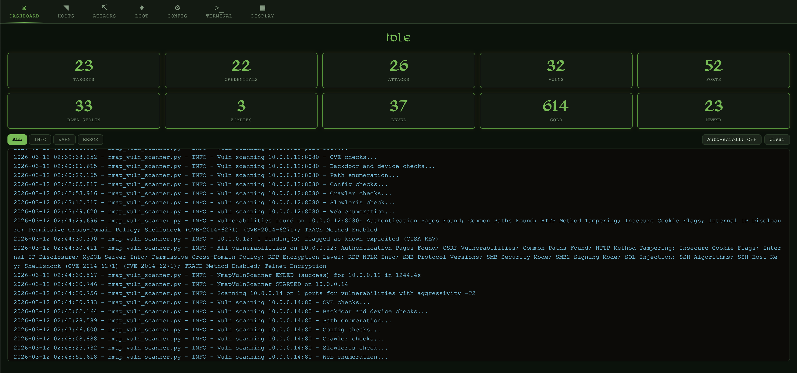

The Dashboard shows orchestrator status, a live stats grid (targets, credentials, attacks, vulns, ports, data stolen, zombies, level, gold, netKB), and an integrated log console with level filters (ALL/INFO/WARN/ERROR), auto-scroll, and incremental log fetching.

## Hosts

  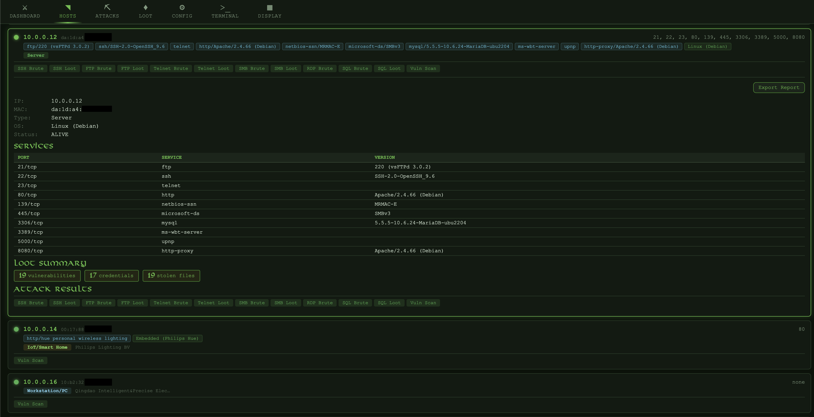

Host cards with color-coded status (green=alive, red=dead, gold=pwned) and per-protocol attack badges showing brute force and file steal results for each host. Click a host to expand details including open ports, credentials, and vulnerabilities.

Host Export View

  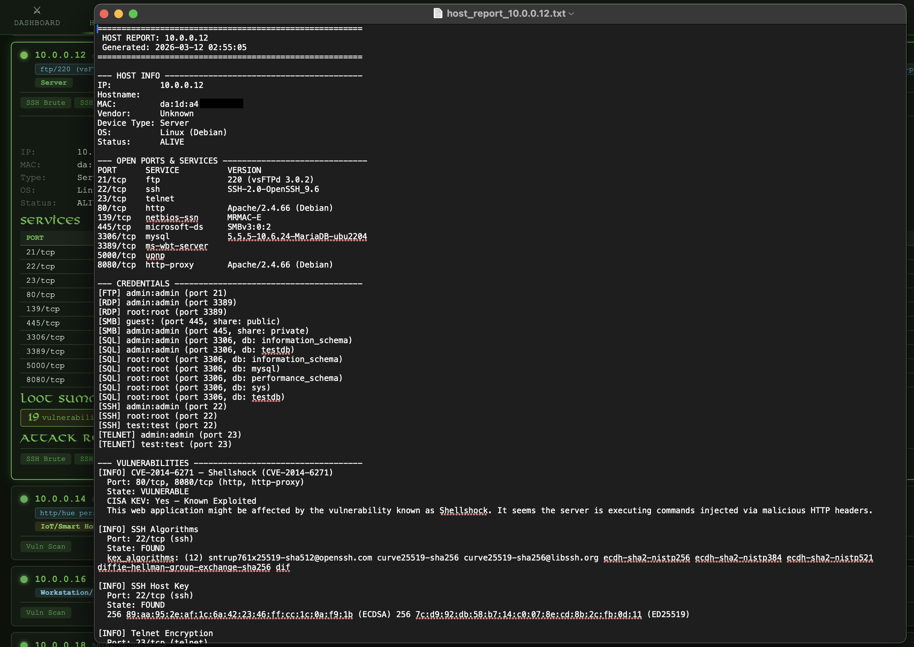

## Attacks

  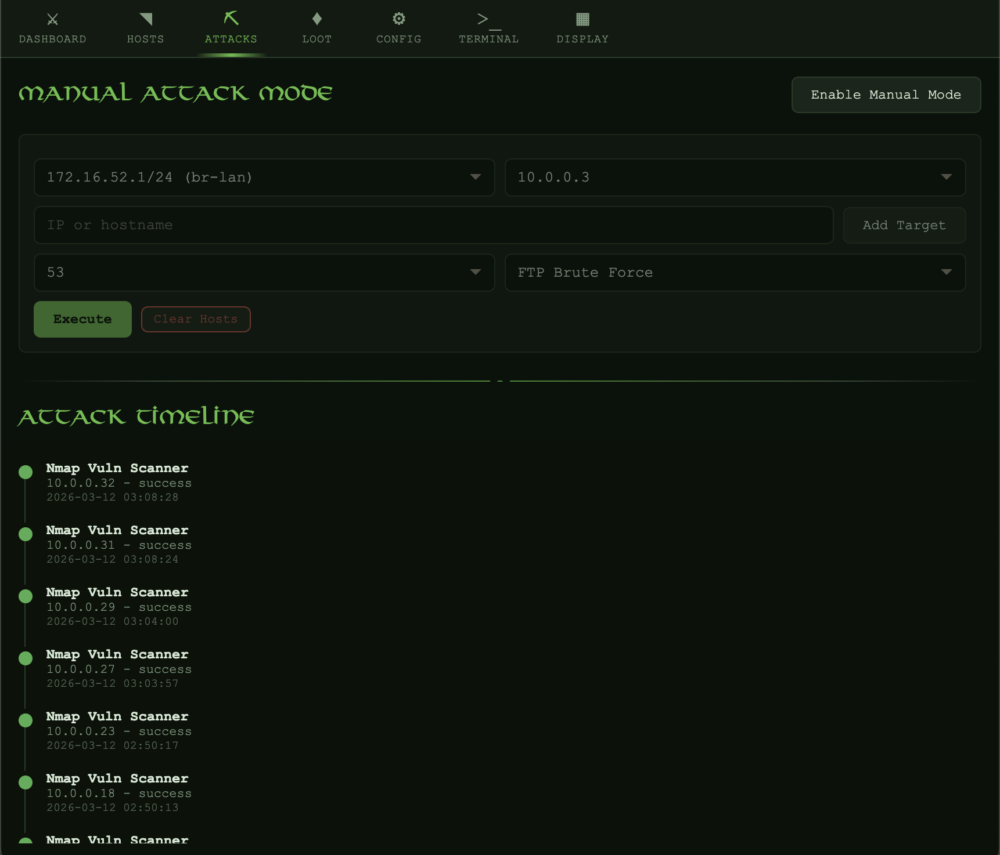

Attack timeline with chronological history. Manual mode with target/port/action dropdowns, custom target input (any IP or hostname), execute and stop buttons, running status indicator, and live attack log output. Vulnerability scanning available per-port or across all open ports.

Manual Attack Mode

  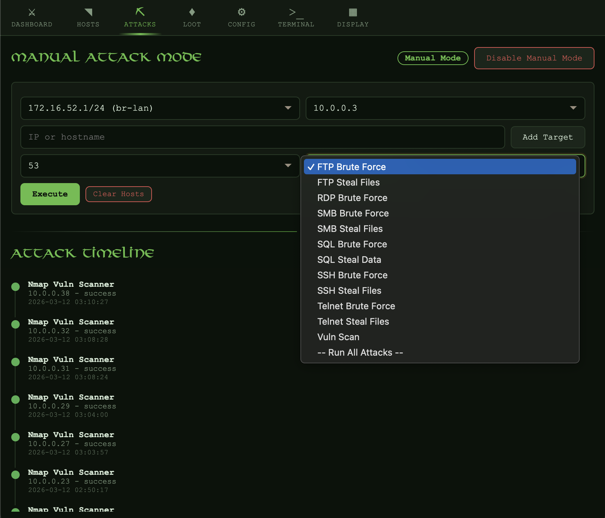

In manual mode, select a target, port, and action from the dropdowns. You can enter any IP address or hostname — including hosts on external networks. Each manual attack shows a live log of its progress.

## Loot

The Loot tab has four sub-tabs:

### Credentials

  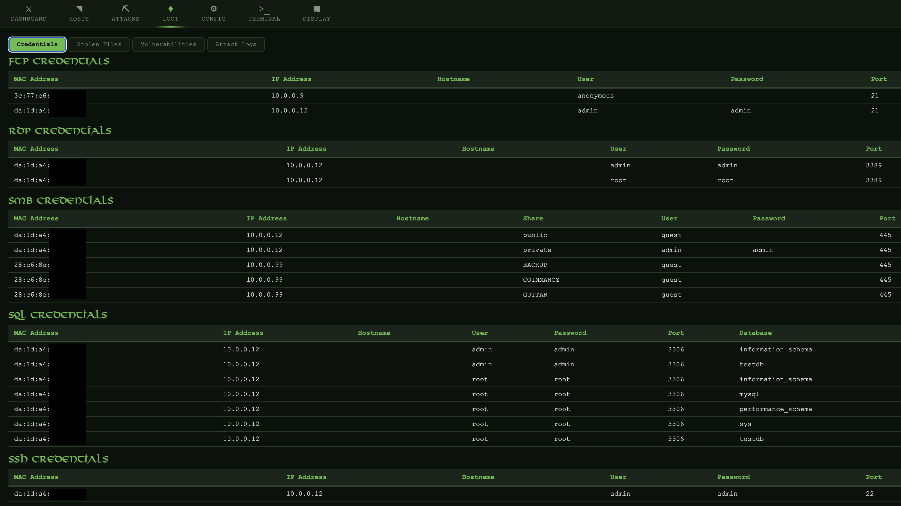

Cracked credentials grouped by protocol with username, password, host, and timestamp.

### Stolen Files

  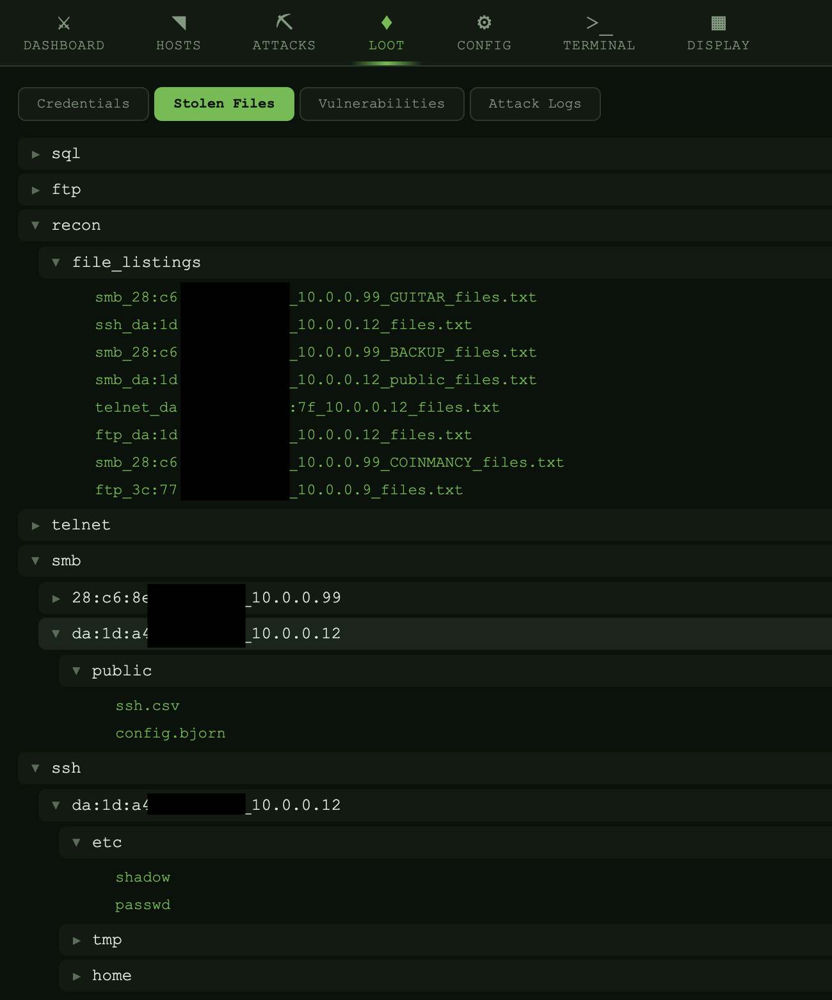

Collapsible file tree organized by protocol and host. Click any file to download it directly.

### Vulnerabilities

  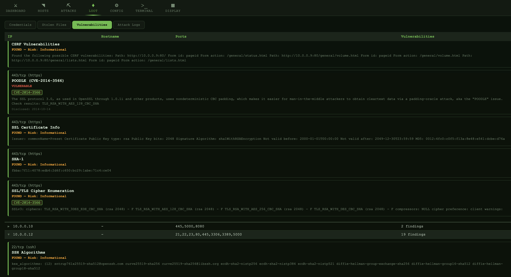

Discovered vulnerabilities with CVE details, severity ratings, and affected hosts/ports.

### Attack Logs

  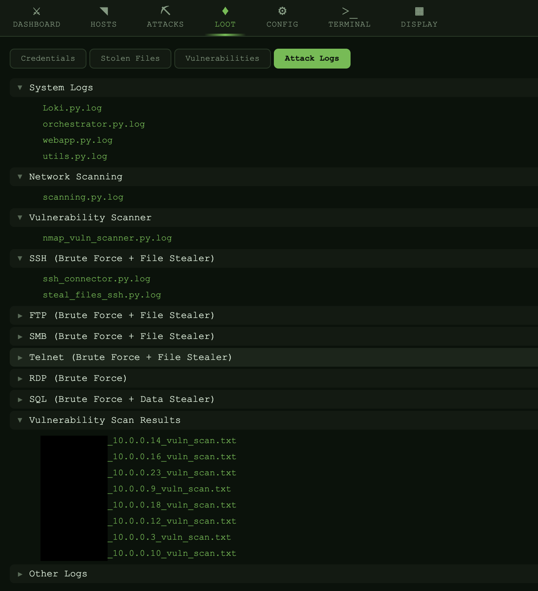

Categorized per-module log files with download links for offline analysis.

## Config

  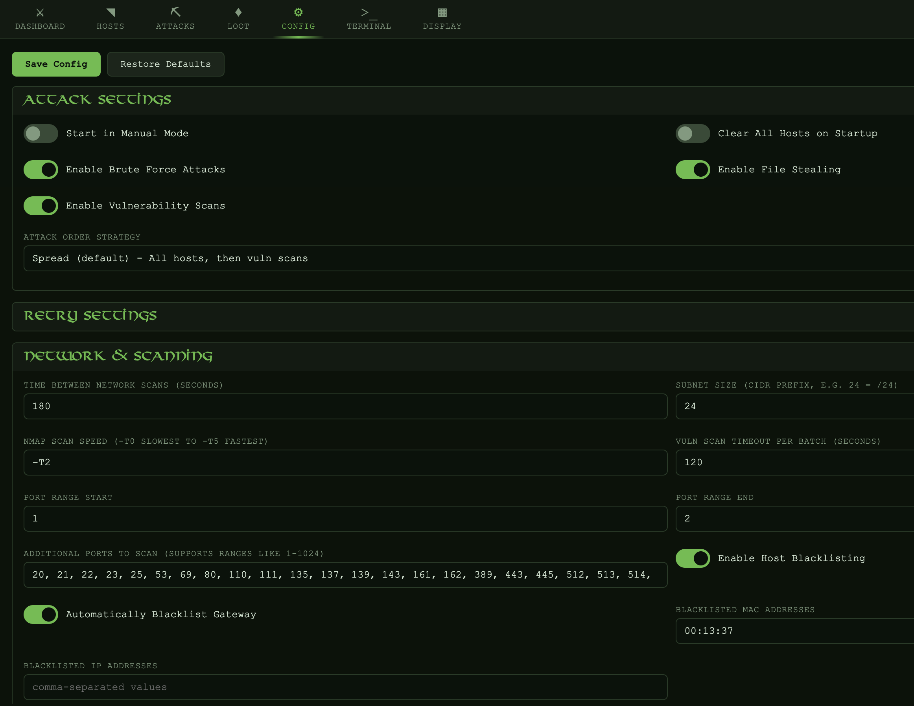

All settings from `shared_config.json` rendered as a form with collapsible sections, toggle switches, and save/restore buttons. Changes take effect immediately — no restart required.

## Terminal

  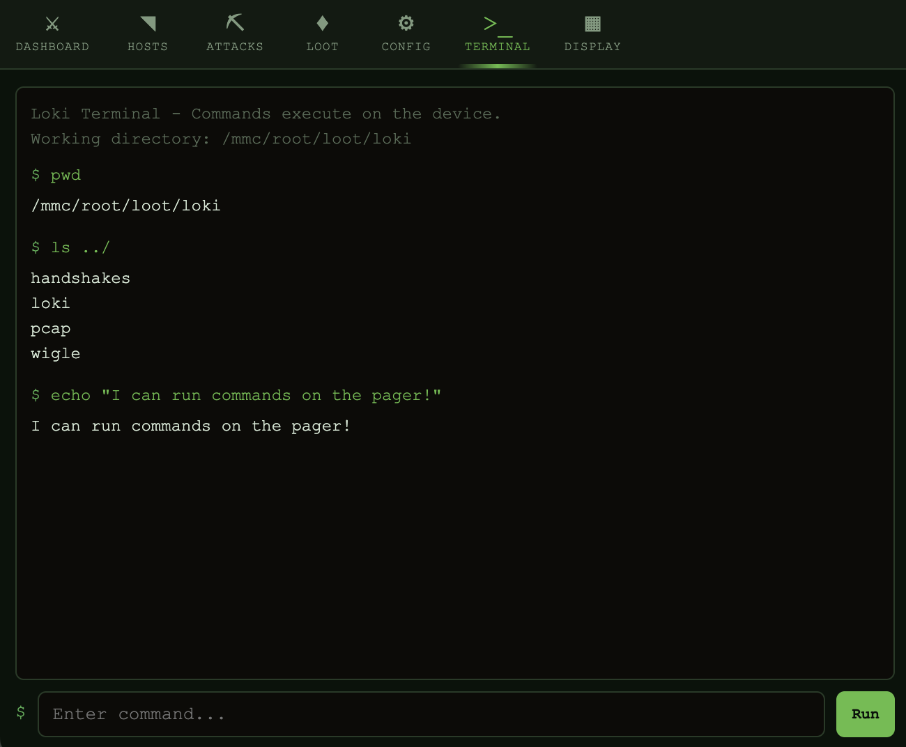

Execute commands directly on the device. Supports command history with up/down arrows (persisted in session). Working directory is the Loki loot directory.

## Display

  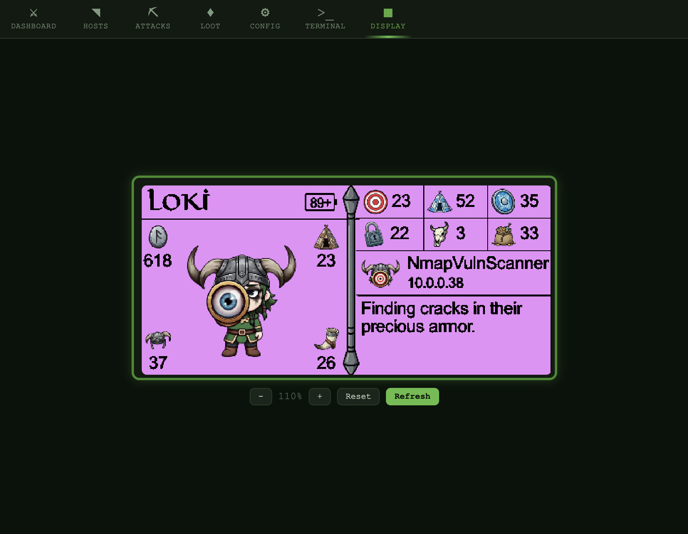

Live LCD mirror — renders the Pager's raw RGB565 framebuffer in the browser in real time. Scroll-to-zoom on desktop, pinch-to-zoom on mobile. The tab label is themeable (configured in `theme.json` via the `web.nav_label_display` field).

## Tab Summary

| Tab | Description |
|-----|-------------|
| **Dashboard** | Orchestrator status, live stats grid, integrated log console |
| **Hosts** | Color-coded host cards with per-protocol attack badges |
| **Attacks** | Attack timeline, manual mode with custom targets and vuln scanning |
| **Loot** | Credentials, stolen files, vulnerabilities, and attack logs |
| **Config** | All settings as a live-editable form |
| **Terminal** | Device command execution with history |
| **Display** | Live LCD framebuffer mirror with zoom |
